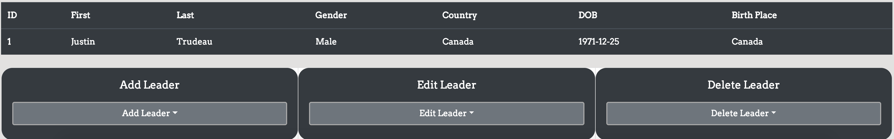

## Spring JPA CRUD Project
#This Week 8 Skill Distillery weekend project
* App allows users to search for current world leaders(updating list) on the database via ID(1-...)
* Bootstrap makes usage extremly easy, prompting the user for information if add, edit, or delete is clicked.

Users have the option to :
* Add a new leader to the database
* Delete a leader from the database
* Edit a leader

### Technologies / Topics
* Spring Boot MVC
* JSP Java 
* SQL/mySQL
* Spring Boot MVC
* JPQL
* Gradle 
* HTML
* CSS
* Bootstrap 
